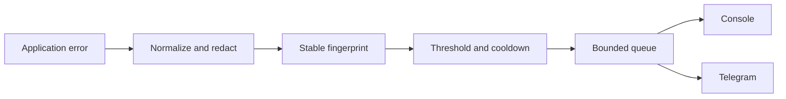

# Wotchi

> Bounded incident alerts for Node.js services.

> **Status:** Public beta (`0.1.0-beta.1`). Install with the `beta` tag; the API may evolve before the first stable release.

[](https://github.com/FutureWindAI/Wotchi/actions/workflows/ci.yml)
[](https://github.com/FutureWindAI/Wotchi/actions/workflows/codeql.yml)
[](https://www.npmjs.com/package/@futurewindai/wotchi)
[](LICENSE)
[](https://nodejs.org/en/about/previous-releases)

Wotchi captures application errors in-process, removes sensitive values, groups repeated failures, and delivers bounded console or Telegram alerts without changing framework response handling.

## Quick start

```bash
npm install @futurewindai/wotchi@beta
```

```ts
import { consoleNotifier, createWotchi } from "@futurewindai/wotchi";

const wotchi = createWotchi({
  service: "orders-api",
  environment: "development",
  grouping: { alertThreshold: 1 },
  notifiers: [consoleNotifier()],
});

wotchi.captureException(new Error("database query failed"));
await wotchi.flush();
```

The example uses a threshold of one so the alert is visible immediately. The default policy groups three matching errors in one minute and suppresses duplicate alerts during the cooldown. Capture is synchronous; call `flush()` when the host needs to wait for notifier work.

Example console output:

```text
Wotchi — Medium incident
Service: orders-api
Environment: development
Summary: Observed 1 occurrences of Error: database query failed.
Occurrences: 1
First seen: 2026-08-08T12:00:00.000Z
Last seen: 2026-08-08T12:00:00.000Z
Suggested checks:
- Check database availability, connection saturation, and recent schema changes.
- Check the affected query and its dependency health before increasing capacity.
```

Timestamps and the fingerprint vary for each run. The alert is sanitized before it reaches a
notifier.

## What you get

| Capability                                | Result                                                                             |
| ----------------------------------------- | ---------------------------------------------------------------------------------- |
| Bounded capture and queueing              | Repeated failures cannot create unbounded in-memory work.                          |
| Redaction before processing               | Sensitive values are removed before grouping, logging, or transmission.            |
| Grouping and cooldowns                    | Repeated failures produce a small number of useful alerts.                         |
| Express 4/5 and NestJS 10/11 adapters     | Errors are observed while the framework keeps response ownership.                  |
| ESM, CommonJS, and TypeScript types       | Use the package with common Node.js module setups.                                 |
| Console and optional Telegram notifiers   | Start locally or self-host delivery without a Wotchi control plane.                |
| Optional status observation and JSON logs | Observe direct `401`/`403`/`429`/`5xx` responses and emit collector-friendly JSON. |

## How it works



The same bounded capture path can be called from HTTP handlers, background workers, and queue
processors. Wotchi does not replace the host application's response, retry, or acknowledgement
logic.

## Framework integrations

Express applications install the middleware after routes and before the existing final error handler:

```ts
import express from "express";
import { consoleNotifier, createWotchi } from "@futurewindai/wotchi";
import { wotchiErrorHandler } from "@futurewindai/wotchi/express";

const app = express();
const wotchi = createWotchi({
  service: "orders-api",
  environment: "production",
  notifiers: [consoleNotifier()],
});

app.use(wotchiErrorHandler(wotchi));
```

NestJS applications register the delegating global filter once after creating the application:

```ts
import { registerWotchiNest } from "@futurewindai/wotchi/nest";

registerWotchiNest(app, wotchi);
```

The package supports Node.js `>=18.18.0`. Express and NestJS adapters are optional subpath integrations, so applications only load the framework adapter they use.

## Telegram alerts

Telegram is an optional self-hosted notifier. Create a bot with BotFather, start or add it to the destination chat, and keep both values outside source control:

```ts
import { consoleNotifier, createWotchi, telegramNotifier } from "@futurewindai/wotchi";

const wotchi = createWotchi({
  service: "orders-api",
  environment: "production",
  notifiers: [
    consoleNotifier(),
    telegramNotifier({
      botToken: process.env.WOTCHI_TELEGRAM_BOT_TOKEN ?? "",
      chatId: process.env.WOTCHI_TELEGRAM_CHAT_ID ?? "",
    }),
  ],
});
```

Wotchi does not ship a shared bot token. Delivery is queued outside the request path and sends only the sanitized incident alert. See [configuration](docs/CONFIGURATION.md) for notifier and security options.

## Process monitoring

Crash observation is opt-in:

```ts
import { registerWotchiProcessMonitor } from "@futurewindai/wotchi";

const monitor = registerWotchiProcessMonitor(wotchi);
// monitor.unregister() when the host intentionally stops observing crashes
```

## What it is not

- A full observability, APM, or log-management platform.
- A hosted dashboard, collector, or persistent incident database.
- An AI-generated incident-summary service in this release.
- A Slack, Discord, email, or generic webhook notifier in this release.
- A Docker, Kubernetes, or Helm collector bundled into the npm SDK.
- An automatic-remediation system.

## Documentation

- [Getting started](docs/GETTING_STARTED.md)
- [Examples](docs/EXAMPLES.md)
- [API reference](docs/API.md)
- [Configuration](docs/CONFIGURATION.md)
- [Compatibility](docs/COMPATIBILITY.md)
- [Performance](docs/PERFORMANCE.md)
- [Architecture](docs/ARCHITECTURE.md)
- [Roadmap](docs/ROADMAP.md)
- [Troubleshooting](docs/TROUBLESHOOTING.md)
- [FAQ](docs/FAQ.md)
- [Security and privacy](docs/SECURITY.md)
- [Threat model](docs/THREAT_MODEL.md)
- [Contributing](CONTRIBUTING.md)
- [Changelog](CHANGELOG.md)
- [GitHub releases](https://github.com/FutureWindAI/Wotchi/releases)
- [Apache License 2.0](LICENSE)

## Security

Do not include real secrets or customer error data in issues, examples, or test fixtures. Report security vulnerabilities privately using [SECURITY.md](SECURITY.md).

Wotchi is open source and maintained by FutureWind AI.
