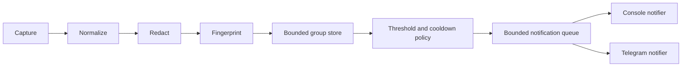

# Wotchi architecture

## Current status

Wotchi is an installable, framework-independent SDK with optional Express and NestJS adapters. The current package provides bounded input handling, URL-aware redaction, fingerprinting, grouping, threshold/cooldown policy, deterministic incident construction, diagnostics, serial notification queueing, text/JSON console and Telegram notifiers, optional HTTP status observation, and opt-in process monitoring.

## Consumer-facing package shape

```text
@futurewindai/wotchi              framework-independent API and public types
@futurewindai/wotchi/express      root API plus Express error middleware
@futurewindai/wotchi/nest         root API plus NestJS registration
```

Each entry point is available as ESM, CommonJS, and declaration output. The root entry point does not import Express or NestJS runtime modules. Framework integrations are loaded only when the corresponding subpath is imported.

## Source boundaries

```text
src/
  index.ts                         stable public root boundary
  core/types.ts                    public domain and configuration contracts
  core/config.ts                   validated immutable runtime configuration
  core/errors.ts                   typed initialization errors
  core/normalize.ts                bounded unknown-value traversal
  core/redact.ts                   key and secret-pattern redaction
  core/stack-frame.ts              application-frame selection
  core/fingerprint.ts              canonical SHA-256 incident identity
  core/rolling-window.ts           fixed-capacity rolling timestamps
  core/group-store.ts              bounded groups and oldest eviction
  core/incident-policy.ts          threshold, cooldown, and severity
  core/incident-builder.ts         deterministic sanitized alerts
  core/notification-queue.ts       serial bounded notifier queue
  core/process-monitor.ts          opt-in uncaught-exception observation
  core/diagnostics.ts              frozen counter snapshots
  core/client.ts                   framework-independent orchestration
  notifiers/console.ts              bounded console formatting
  notifiers/telegram-format.ts      bounded HTML alert formatting
  notifiers/telegram-http.ts        fixed-host HTTPS transport
  notifiers/telegram.ts             Telegram notifier adapter
  integrations/express/index.ts    Express-only public boundary
  integrations/express/status-observer.ts  opt-in direct-response observation
  integrations/nest/index.ts      NestJS-only public boundary
```

Future changes should add behavior behind these contracts:

```text
capture -> normalize -> redact -> fingerprint -> group
        -> policy -> bounded queue -> console/Telegram notifier
```



Capture performs bounded normalization, redaction, fingerprinting, grouping, policy evaluation, incident construction, and queue admission synchronously. Fingerprints normalize numeric, UUID-like, and hexadecimal dynamic values so repeated failures with changing IDs normally share one group. Queue work runs with concurrency one and is never awaited by framework error handling. The same core capture path is available to background workers and queue processors; the host remains responsible for retry, acknowledgement, and dead-letter behavior. Express calls `next(error)` exactly once; NestJS calls `super.catch(exception, host)` exactly once. Telegram work is bounded and asynchronous. Process monitoring uses `uncaughtExceptionMonitor` only, captures a critical event, and does not suppress or change the host process exit behavior; an immediately terminating process is not promised a synchronous network flush.

The status observer is separate from error handling and runs on the response `finish` event. It
captures only configured status codes/classes, supports ignored noisy codes and a per-status
threshold, and never reads response bodies or headers. The Express error handler and NestJS
exception filter mark captured errors so a response generated by the normal error path is not
captured a second time.

## Package build

- `dist/esm/` is the ESM build.
- `dist/cjs/` is the CommonJS build and contains a local `package.json` declaring `type: commonjs`.
- `dist/types/` contains declarations.
- `dist/types-cjs/` contains CommonJS `.d.cts` declarations selected by the `require` export condition.
- `package.json` exports explicit `import`, `require`, and `types` targets for every public subpath.
- `files` limits the eventual npm archive to `dist`, `README.md`, `SECURITY.md`, and `LICENSE`.

## Product constraints

- zero direct runtime dependencies in the current release;
- optional Express and NestJS peer dependencies;
- Node.js `>=18.18.0` compatibility target;
- bounded memory, queues, payloads, and traversal;
- redact before storage, fingerprinting, logging, or transmission;
- no request/response bodies, raw headers, automatic environment collection, or hosted collector in v0.1;
- console and Telegram are the only notification channels in the current release.

See [Security](SECURITY.md) and [Threat model](THREAT_MODEL.md) for the security boundary and residual risks.
